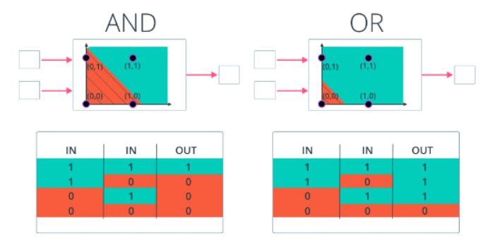
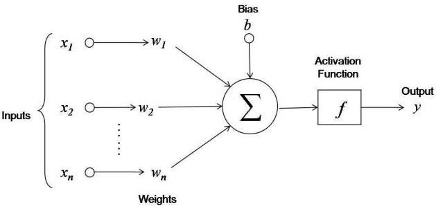
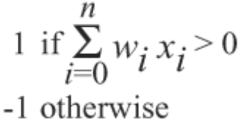
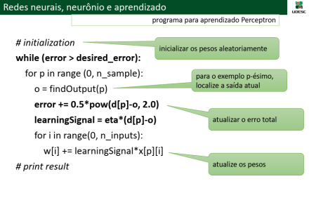
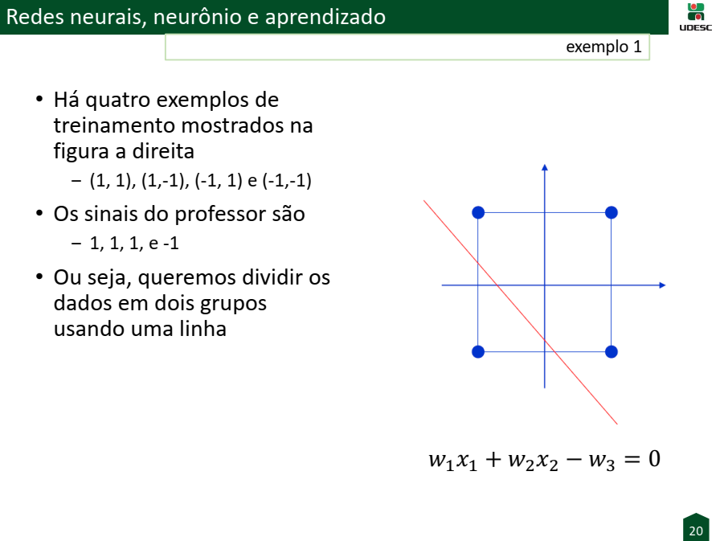
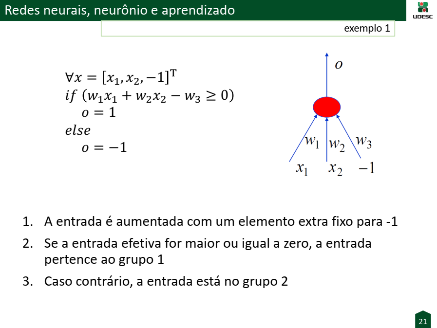
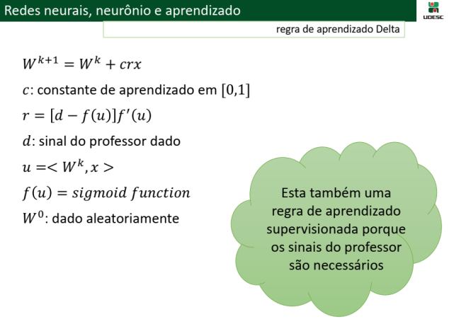
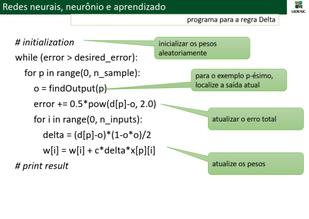

# Machine Learning

Prof. Claudinei Dias (Ney)

## Atividade 03 - Artificial Neural Network (ANN): Perceptron

### Problema das portas lógicas AND e OR

Construa uma rede neural artifical Perceptron (um neurônio) e treine esta rede para resolver o problema das portas lógicas AND e OR que são linearmente separáveis.

- As entradas (xi) são constituídas por um par de valores (x1, x2) que representam os sinais lógicos de entrada e também por um valor (x3 = -1) elemento fictício extra para que a entrada seja calculada simplesmente usando o produto interno.
- Se a entrada efetiva for maior ou igual a zero, a entrada pertence a classe A.
- Caso contrário, a entrada pertence a classe B.

<p align="center" style="text-align: center;">
    <br />
    <br />
    
</p>

### Opções para desenvolvimento em Python

#### Online

- Replit - https://replit.com/languages/python
- Google Colab - https://colab.research.google.com/

#### Stand-alone

- Python - https://www.python.org/downloads/
- Pycharm - https://www.jetbrains.com/pt-br/products/#type=ide
- Anaconda - https://www.anaconda.com/

#### Bibliotecas

- scikit-learn - https://scikit-learn.org/
- pandas - https://pandas.pydata.org/
- Keras - https://keras.io/

### Resolução

<p align="center" style="text-align: center;">
    
    
    <br />
    
    
</p>

Possível algoritmo para o problema AND e OR usando a regra de aprendizado do Perceptron:

```python
import numpy as np

def f(u):
    if u >= 0:
        return 1
    else:
        return -1

def find_output(data, w):
    u = 0.0
    for i in range(0, len(data)):
        u += data[i] * w[i]

    return f(u)

# initialization
p = [[1,1,-1],[1,-1,-1],[-1,1,-1],[-1,-1,-1]]
d = [1, 1, 1, -1]
w = np.random.rand(len(p[0]))

c = 0.5
d_error = 0.01

iter = 0
while True:
    error = 0
    for i in range(0, len(p)):
        o = find_output(p[i], w)
        error += ((d[i] - o) ** 2) / 2
        learning_signal = c * (d[i] - o)
        for k in range(0, len(p[i])):
            w[k] += learning_signal * p[i][k]

    iter += 1
    print(error, "##", w)
    if error <= d_error:
        print('N. iterations:', iter)
        break

print(find_output([1,1,-1],w))
print(find_output([1,-1,-1],w))
print(find_output([-1,1,-1],w))
print(find_output([-1,-1,-1],w))
```

### Exercício 1

Repita o exercício 1 sobre o problema das portas lógicas utilizando a Regra Delta de aprendizado

<p align="center" style="text-align: center;">
    
    
</p>

Possível algoritmo para o problema AND e OR usando a regra de aprendizado Delta:

```python
import math
import numpy

def f(u):
    return (2 / (1 + math.exp(-u))) - 1

def find_output(data, w):
    u = 0.0
    lamb = .10
    for i in range(0, len(data)):
        u += w[i] * data[i]
    return f(lamb * u)

# initialization
p = [[1, 1, -1], [1, -1, -1], [-1, 1, -1], [-1, -1, -1]]  # conjunto de valores de entrada ampliados com a entrada dummy
d = [1, 1, 1, -1]  # saidas desejadas
w = numpy.random.rand(len(p[0]))  # inicializacao randomica dos pesos

c = 0.5  # taxa de aprendizado
d_error = 0.01  # erro desejado

iter = 0
while True:
    error = 0
    for i in range(0, len(p)):
        o = find_output(p[i], w)
        error += 0.5 * (d[i] - o) ** 2.0
        delta = (d[i] - o) * (1 - o * o) / 2
        for k in range(0, len(p[i])):
            w[k] += c * delta * p[i][k]

    iter += 1
    print(error, "##", w)
    if error < d_error:
        print('N. iterations:', iter)
    break

print(find_output([1, 1, -1], w))
print(find_output([1, -1, -1], w))
print(find_output([-1, 1, -1], w))
print(find_output([-1, -1, -1], w))
# print result
```

### Exercício 2

Realizar a leitura e todos os exercícios do capítulo "Aplicações Práticas e Exercícios" (página 36 até 39) do livro ["Redes Neurais Artificiais: uma abordagem para sala de aula"](https://pdfcoffee.com/e-book-redes-neurais-artificiais-uma-abordagem-para-sala-de-aula-pdf-free.html) da autora Maria Inês Vasconcellos Furtado.