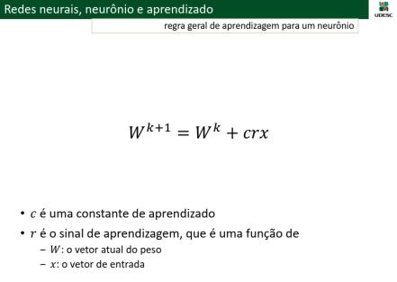
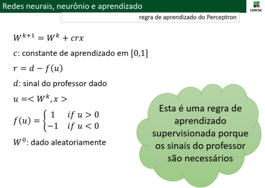

# Machine Learning

Prof. Claudinei Dias (Ney)

## Atividade 03 - Artificial Neural Network (ANN): Perceptron

### Problema das portas lógicas AND e OR

Construa uma rede neural artifical Perceptron (um neurônio) e treine esta rede para resolver o problema das portas lógicas AND e OR que são linearmente separáveis.

- As entradas (xi) são constituídas por um par de valores (x1, x2) que representam os sinais lógicos de entrada e também por um valor (x3 = -1) elemento fictício extra para que a entrada seja calculada simplesmente usando o produto interno.
- Se a entrada efetiva for maior ou igual a zero, a entrada pertence a classe A.
- Caso contrário, a entrada pertence a classe B.

     
     
    

### Opções para desenvolvimento em Python

#### Online

- Replit - https://replit.com/languages/python
- Google Colab - https://colab.research.google.com/

#### Stand-alone

- Python - https://www.python.org/downloads/
- Pycharm - https://www.jetbrains.com/pt-br/products/#type=ide
- Anaconda - https://www.anaconda.com/

#### Bibliotecas

- scikit-learn - https://scikit-learn.org/
- pandas - https://pandas.pydata.org/
- Keras - https://keras.io/

### Resolução da questão 1

    
    
     
    
    

